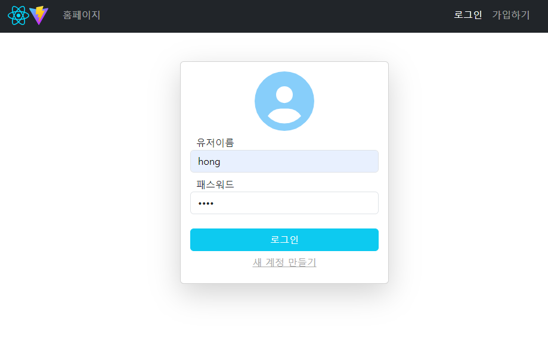
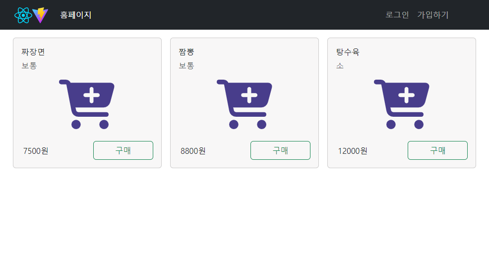
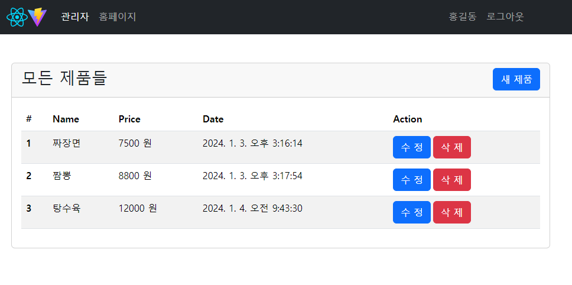
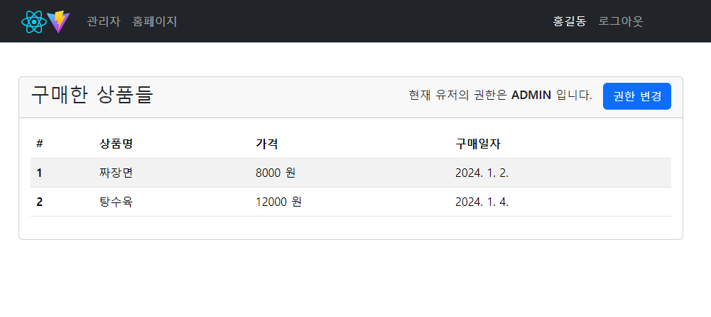

# React shop

간단한 쇼핑몰 프로젝트

React + Vite로 제작한 프론트엔드

스프링부트로 제작한 <a href="https://github.com/KaengEE/shop-backend">백엔드</a>

_스프링부트를 사용해서 백엔드를 만들고 만든 서비스와 컨트롤러를 사용하여_

_프론트엔드에서 로그인/회원가입, 제품 추가/삭제/수정, 제품 구매,_

_유저 권한 변경을 구현해 본 프로젝트_

## 기능

- 유저/관리자 구분
- 회원가입/로그인
- 제품 등록/삭제/조회
- 유저의 제품 구매
- 유저별 구매 리스트
- 유저 ROLE(권한) 변경

### 로그인 페이지

### 홈페이지

### 관리자페이지

### 프로필페이지

### 배포링크

*무료서버 사용해서 서버 중지*

<a href="https://react-shop-kaengee.netlify.app/">배포</a>
